>  
> [Azure Cosmos DB](https://docs.microsoft.com/azure/cosmos-db/)

# Scaling, performance, and flexibility in Azure Cosmos DB

This demo script will help you demonstrate Azure Cosmos DB to an audience. The script comprises of a single Setup section that should be followed prior to starting the demo and three demo sections for each of the categories that will be demoed: "Scalability", "Performance", and "Flexibility".

===

# Demo notes

- The resource names may change in the screenshots. This occurs because the ARM template dynamically generates a unique name each time a demo is performed. You can safely disregard the resource names.
- There is a known issue where the Azure Cosmos DB account requires 10 minutes to replicate globally after it is deployed. If you attempt to populate the database before then, you will see an exception message.

===

# Demo setup

This section should be completed prior to starting the demo. In this section, you will deploy the following resources:

- Azure Cosmos DB account in West US region
- Azure Container Instance in West US region
    - This instance will be used to initially seed and populate the database
- Azure Container Instances in Southeast Asia, North Europe, and West US regions
    - These instances will be used to test global performance of the account

Throughout this setup section, we will share animated images that will help you navigate the Azure portal and learn where specific features are located. The instructions in the remaining sections will use the same features in the portal so it is recommended to repeat the setup multiple times if you are unfamiliar with the Azure Cosmos DB experience in the portal.

## Step-by-step instructions

1. To get started, you must first deploy an [ARM template](azuredeploy.json) that will deploy all of the Azure Cosmos DB and Azure Container Instances resources and correctly configure them.

    > If you are using LODS as your demo environment, this ARM template will already have been deployed for you. There is no need to deploy the template a second time.

    For ease, you can click the link below to deploy your ARM template:

    <a href="https://portal.azure.com/#create/Microsoft.Template.2.0.0/uri/https%3A%2F%2Fraw.githubusercontent.com%2Fseesharprun%2Fcosmos-demo%2Fmaster%2Fazuredeploy.json" target="_blank">
        
    </a>

    > A typicaly deployment takes approximately ten minutes.

1. Once your environment is deployed, you can observe the Azure Cosmos DB account in your Azure subscription.

    

    > The name of your resource group may differ from the screenshots.

1. Go to your resource group, locate and select the **Azure Container Instance** with **-populate-** in the name.

    

1. In the **Settings** section of the container instance, select the **Containers** option to view your current container.

1. Click the **Connect** tab, select the **/bin/bash** option and then click the **Connect** button to connect to the running container.

    

1. Within the container, run the following command to populate your Azure Cosmos DB instance:

    ```
    ./cosmosbenchmark --location westus --type populate --database IoTDatabase --collection DeviceDataCollection --throughput 25000
    ```

1. Observe the output from the container application as it populates your Azure Cosmos DB instance with data.

    

1. Wait for the benchmark application to finish processing.

1. Navigate back to the Azure Cosmos DB instance.

1. Select the **Data Explorer** option to view your newly created database and collection.

    

1. In the Data Explorer, select the **DeviceDataCollection** collection and then click the **New SQL Query** button.

    

1. In the **New SQL Query** window, enter the following SQL command:

    ```
    SELECT * FROM data
    ```

1. Click the **Execute Query** button to issue the query and observe the query results.

    

1. Enter and execute the following command:

    ```
    SELECT COUNT(1) FROM data
    ```

1. Click the **Documents** link under the **DeviceDataCollection** node and then click the **New Document** button.

    

1. In the document editor, enter the following JSON content:

    ```
    {
        "Version": 1,
        "DeviceId": "59eec13e-160b-4e63-a20c-bb9ea57208e4",
        "LocationId": "2f4a4707-ca74-447f-aa90-d03bbbc27d2d",
        "DeviceLocationComposite": "59eec13e-160b-4e63-a20c-bb9ea57208e4_2f4a4707-ca74-447f-aa90-d03bbbc27d2d",
        "SubmitDay": "2018-10-25",
        "SubmitHour": "2018-10-25-18",
        "SubmitMinute": "2018-10-25-18-24",
        "SubmitSecond": "2018-10-25-18-24-35",
        "TemperatureCelsius": 21.216567948561426,
        "Humidity": 0.2047588327456074
    }
    ```

1. Click the **Save** button to persist the document and then observe the newly created document.

    

1. Finally in the Data Explorer, select the **DeviceDataCollection** collection and then click the **Scale and Settings** option.

    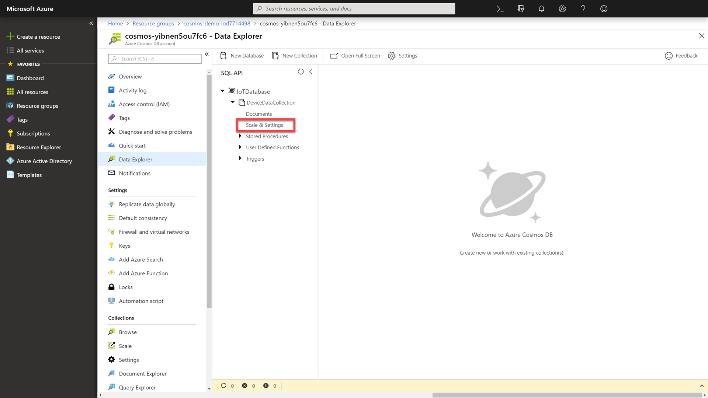

1. In the settings pane, change the throughput of the collection to ``10000`` RUs (request units).

    > It is typical to use more RUs for a data import task and then to scale back down to your "normal" thoughput allocation.

1. Click the **Save** button at the top of the settings pane.

    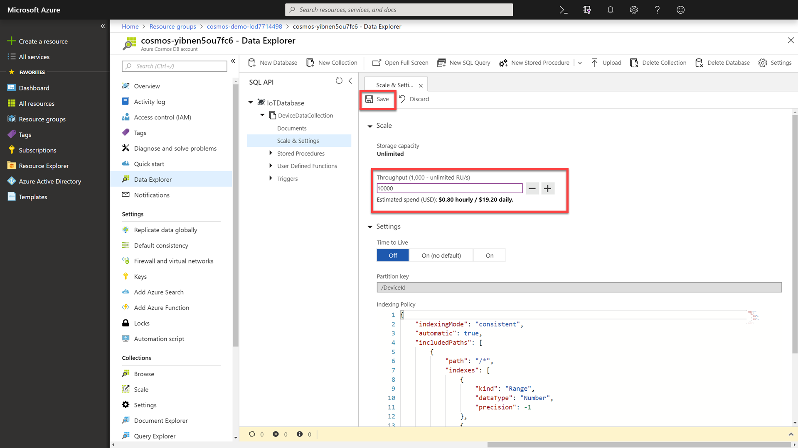

===

# Scalability and elasticity with Azure Cosmos DB

For the first demo, we will compare write performance at two different throughput levels. We will start with a low throughput level (10K-50K range) and then test writes using a higher throughput level (100K+ range). The goal in this demo is to show how performance and throughput is a "knob" that can be adjusted dynamically to meet an application's changing needs.

## Step-by-step instructions

1. To start, we will go into the Azure Cosmos DB account. This can be accomplished by clicking on the **Resource Groups** link in the portal, selecting your previously created group and then selecting the sole **Azure Cosmos DB** resource.

    

1. In the Azure Cosmos DB resource's blade, select the **Data Explorer** option.

    

1. In the **Data Explorer**, click the **New Collection** button.

    

    > You can call out to attendees that you will create a new collection where you intend to perform the demo.

1. In the **New Collection** popup, perform the following actions:

    1. In the **Database id** section, select the **Create new** option, and enter the value ``TestDatabase`` in *Type a new database id* field.

    1. Ensure that the **Provision database throughput** checkbox is not selected.

    1. In the **Collection id** field, enter the value ``ThroughputDemo``.

    1. In the **Storage capacity** section, select the **Unlimited** option.

    1. In the **Partition key** field, enter the value ``/DeviceId``.

    1. In the **Throughput** section, enter the value ``2000``.

    1. Click the **OK** button.

    1. Wait for the new database and collection to be created.

    

1. Click on the **Resource Groups** link in the portal, selecting your previously created group, and then select the **Container instances** resource with **-westus-** in the name.

    

    > Point out to attendees that you are selecting a container that is running in the same region as your Azure Cosmos DB account. This container has a benchmarking application built-in that is open-source and written using .NET Core.

1. In the **Settings** section of the container instance, select the **Containers** option to view your current container.

    

1. In the **Containers** section, locate and click the **Connect** tab.

    

1. In the **Connect** tab, select the **/bin/bash** option and then click the **Connect** button to connect to the running container.

    

1. Within the container, run the following command to benchmark the write performance of your Azure Cosmos DB instance:

    ```
    ./cosmosbenchmark --location westus --type write --database TestDatabase --collection ThroughputDemo --throughput 2000
    ```

    

    > This benchmark application will blast the account with writes. Explain to the attendees that this benchmark application will usee 5000 RUs to test how long it takes to upload 10,000 documents. In our testing, this can take anywhere from 45-60 seconds.
    
1. Click on the **Resource Groups** link in the portal, selecting your previously created group, and then select the sole **Azure Cosmos DB** resource.

1. In the Azure Cosmos DB resource's blade, select the **Data Explorer**.

1. In the Data Explorer, expand the **TestDatabase** database, select the **ThroughputDemo** collection, and then click the **Scale & Settings** option.

    
  
1. In the settings pane, change the throughput of the collection from ``2000`` to ``10000`` RUs (request units).

    > Let the attendees know that we are exponentially increasing the RUs by five times. Point out that we have now elastically scaled our database by only changing a simple field and clicking a save button.

1. Click the **Save** button at the top of the settings pane.

    

1. Click on the **Resource Groups** link in the portal, selecting your previously created group, and then select the **Container instances** resource with **-westus-** in the name.

1. In the **Settings** section of the container instance, select the **Containers** option to view your current container.

1. Click the **Connect** tab, select the **/bin/bash** option and then click the **Connect** button to connect to the running container.

1. Within the container, run the following command to benchmark the write performance of your Azure Cosmos DB instance again with the new throughput level:

    ```
    ./cosmosbenchmark --location westus --type write --database TestDatabase --collection ThroughputDemo --throughput 10000
    ```

    > Point out to attendees the difference in performance between the two benchmarks. In our testing, the second benchmark completed in 5-10 seconds.

    > If an attendee ask why we are "telling" the benchmark application about our throughput, this is to avoid rate limiting. Our benchmark application is using a simple math formula to determine how much data it can send in parallel while avoiding rate limiting for the entire collection. If we didn't tell the benchmark application about our throughput limit, it could potentially send too much data at once and get a HTTP 429 error code.

## More Reading

If attendees want to learn more about scaling throughput in Azure Cosmos DB, it is recommended that they read the following article: <https://docs.microsoft.com/azure/cosmos-db/request-units>

===

# Azure Cosmos DB Performance

For the next demo, we will run a script that uses a high-resolution timer to measure the read performance between different Azure Container Instances across various Azure regions and a multi-region Azure Cosmos DB instance. Our intention is to show how having multiple read regions for an Azure Cosmos DB account will make it functionally behave like a CDN for dynamic data.

## Step-by-step instructions

1. To start, we will go into the Azure Cosmos DB account. This can be accomplished by clicking on the **Resource Groups** link in the portal, selecting your previously created group, and then selecting the sole **Azure Cosmos DB** resource.

    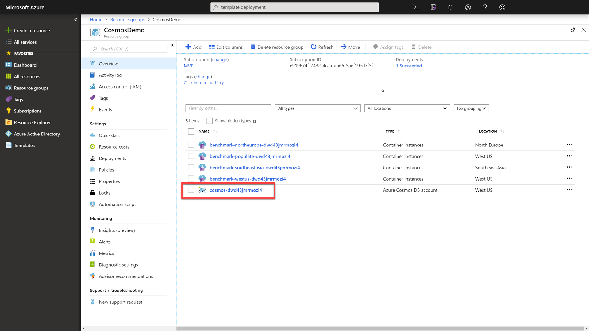

1. In the Azure Cosmos DB resource's blade, select the **Data Explorer** option.

    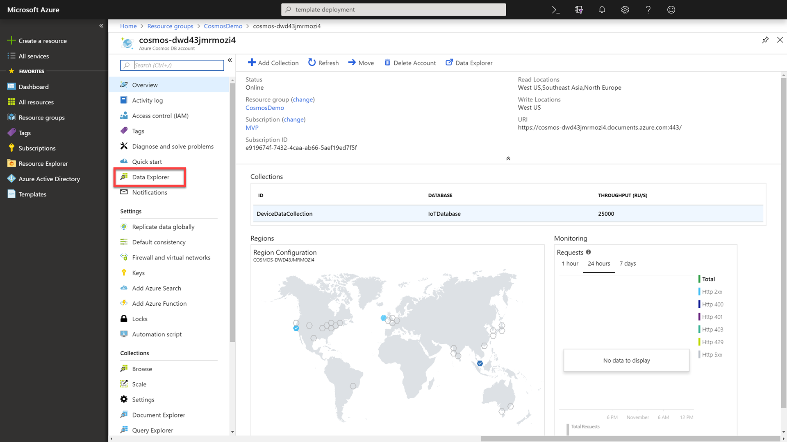

1. In the **Data Explorer**, locate and expand the existing **IoTDatabase** database. Then select the **DeviceDataCollection** collection.

    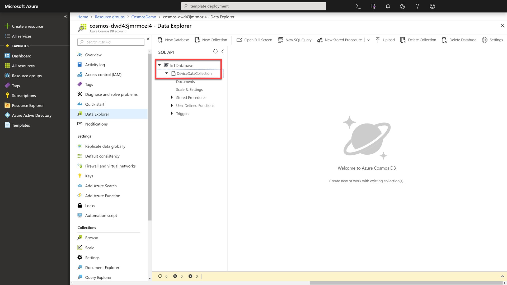

    > Call out to attendees that you have pre-created a collection with 50,000 documents. We will use this collection in our read benchmark.

1. Click the **New SQL Query** button.

    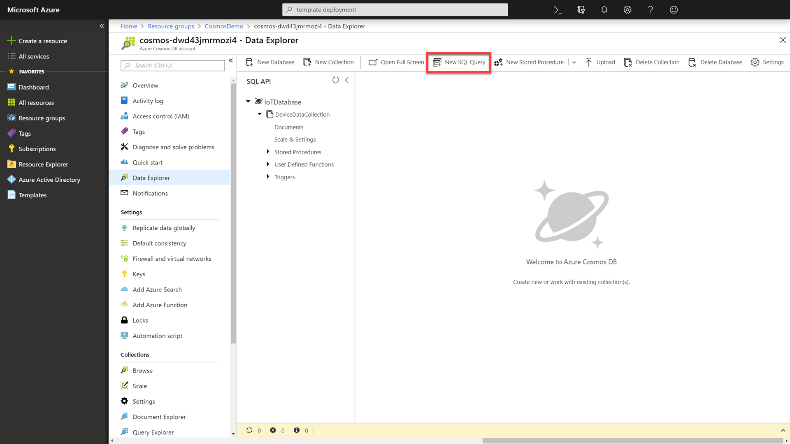

1. In the **New SQL Query** window, enter the following SQL command:

    ```
    SELECT TOP 1 * FROM data WHERE data.DeviceId = "00000000-0000-0000-0000-000000000000"
    ```

    > We know that there is a device out there with a Device Id of "00000000-0000-0000-0000-000000000000". This query will return the first record associated with that partition key. 

1. Click the **Execute Query** button to issue the query and observe the query results.

    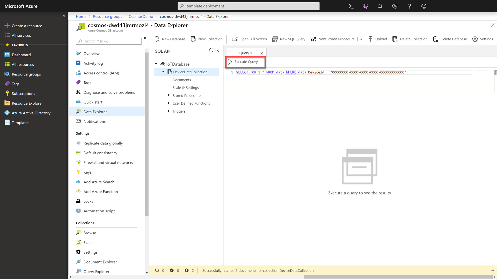

    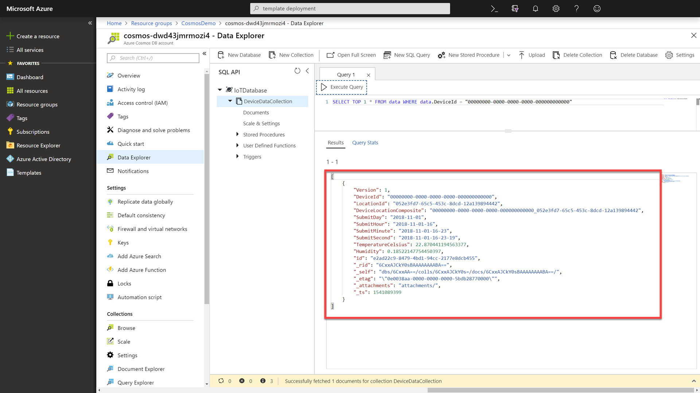

    > This is the record we will use when we test read performance.

1. Click on the **Resource Groups** link in the portal, selecting your previously created group, and then select the **Container instances** resource with **-westus-** in the name.

    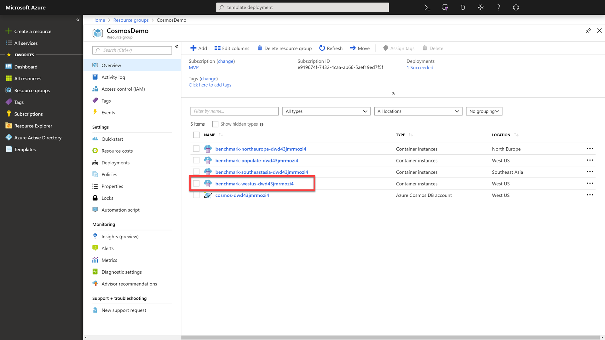

    > Point out to attendees that you are selecting a container that is running in the same region as your Azure Cosmos DB account. In the absence of global distribution, we would have to send requests around the world. This can create a lot of latency. To reduce latency, we deployed this Azure Container Instance to the same region as our Azure Cosmos DB account.

1. In the **Settings** section of the container instance, select the **Containers** option to view your current container.

    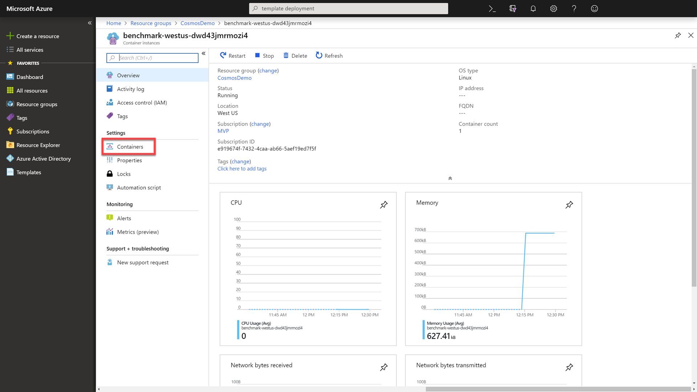

1. In the **Containers** section, locate and click the **Connect** tab.

    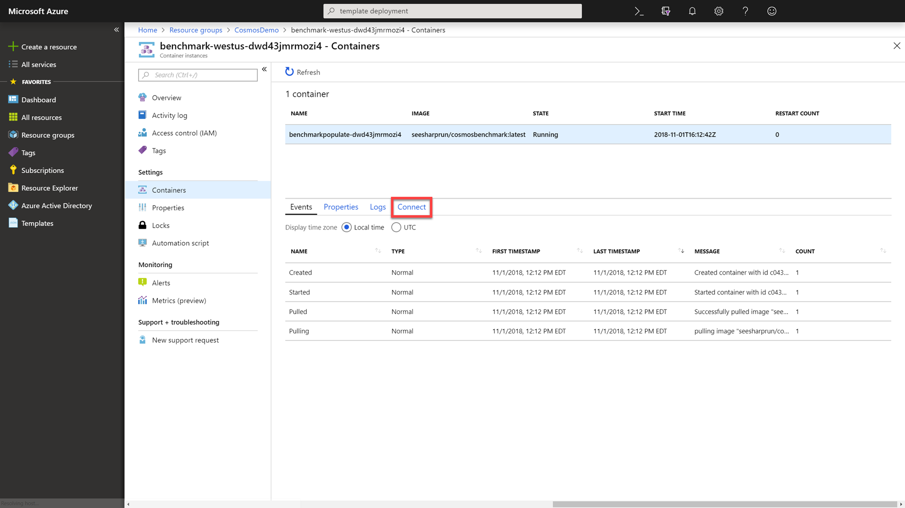

1. In the **Connect** tab, select the **/bin/bash** option and then click the **Connect** button to connect to the running container.

    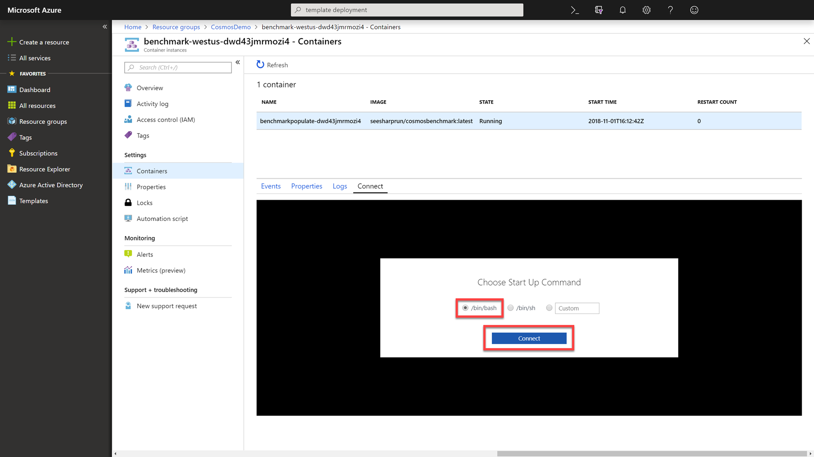

1. Within the container, run the following command to benchmark the read performance of your Azure Cosmos DB instance:

    ```
    ./cosmosbenchmark --location westus --type read --database IoTDatabase --collection DeviceDataCollection
    ```

    > This read operation was very fast. We can attribute this to the fact that we have both our Azure Cosmos DB account and our container instance in the same region.

    

1. Click on the **Resource Groups** link in the portal, selecting your previously created group, and then select the sole **Azure Cosmos DB** resource again.

1. In the Azure Cosmos DB resource's blade, select the **Replicate data globally** option.

    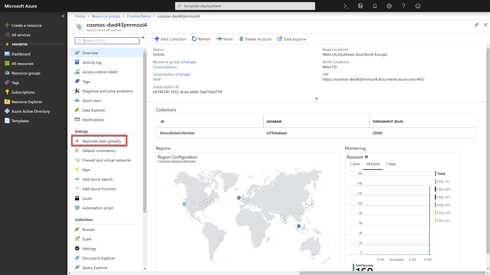

1. Observe that the database is already replicated to the **West US**, **Southeast Asia**, and **North Europe** regions.

    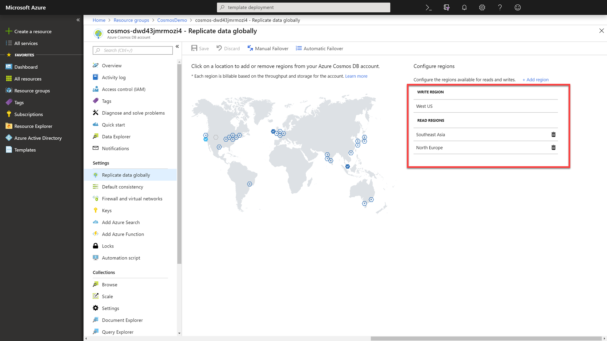
    
1. Click on the **Resource Groups** link in the portal, selecting your previously created group, and then select the **Container instances** resource with **-westus-** in the name.

1. In the **Settings** section of the container instance, select the **Containers** option to view your current container.

1. In the **Containers** section, locate and click the **Connect** tab.

1. In the **Connect** tab, select the **/bin/bash** option and then click the **Connect** button to connect to the running container.

1. Within the container, run the following command to benchmark the read performance of your Azure Cosmos DB instance using a different region:

    ```
    ./cosmosbenchmark --location southeastasia --type read --database IoTDatabase --collection DeviceDataCollection
    ```

    > We are using our **West US** container instance to try and read data from the Azure Cosmos DB **Southeast Asia** read region. Unfortunately, our request has to be sent around the world and this causes a lot of latency. No matter what, you can't beat the speed of light (physics).

    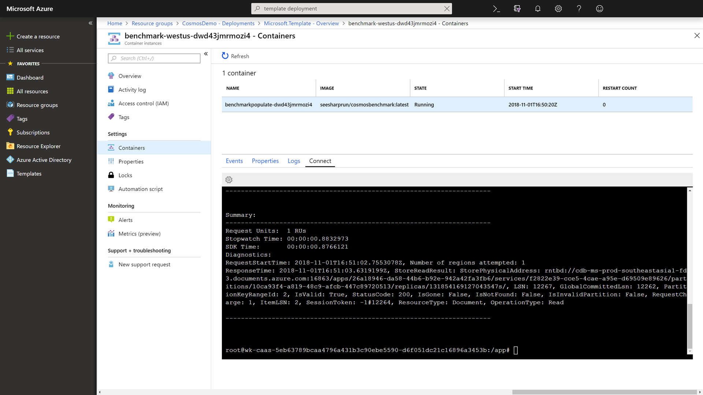

1. Click on the **Resource Groups** link in the portal, selecting your previously created group, and then select the **Container instances** resource with **-southeastasia-** in the name.

    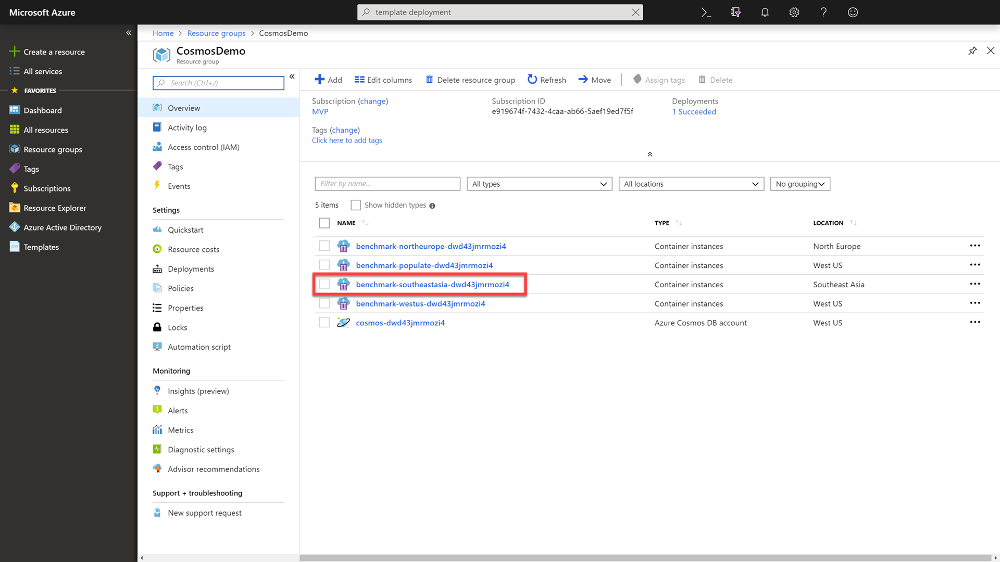

1. In the **Settings** section of the container instance, select the **Containers** option to view your current container.

1. In the **Containers** section, locate and click the **Connect** tab.

1. In the **Connect** tab, select the **/bin/bash** option and then click the **Connect** button to connect to the running container.

1. Within the container, run the following command to benchmark the read performance of your Azure Cosmos DB instance using the same region as the container:

    ```
    ./cosmosbenchmark --location southeastasia --type read --database IoTDatabase --collection DeviceDataCollection
    ```

    > We are now using the **Southeast Asia** container instance to try and read data from the Azure Cosmos DB **Southeast Asia** read region. You can see a  performance difference here. We have "cheated" the speed of light by bringing the data closer to the application/client.

    

1. Click on the **Resource Groups** link in the portal, selecting your previously created group, and then select the **Container instances** resource with **-northeurope-** in the name.

    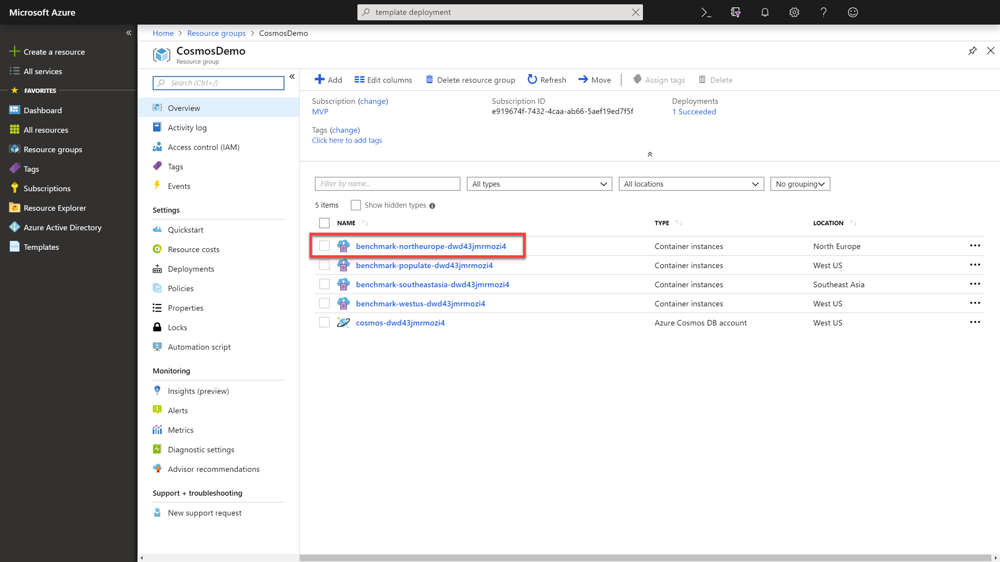

1. In the **Settings** section of the container instance, select the **Containers** option to view your current container.

1. In the **Containers** section, locate and click the **Connect** tab.

1. In the **Connect** tab, select the **/bin/bash** option and then click the **Connect** button to connect to the running container.

1. Within the container, run the following command to benchmark the read performance of your Azure Cosmos DB instance using the same region as the container:

    ```
    ./cosmosbenchmark --location northeurope --type read --database IoTDatabase --collection DeviceDataCollection
    ```

    > Since we have multiple clients and multiple Azure Cosmos DB read locations. We essentially have a CDN for dynamic data.

    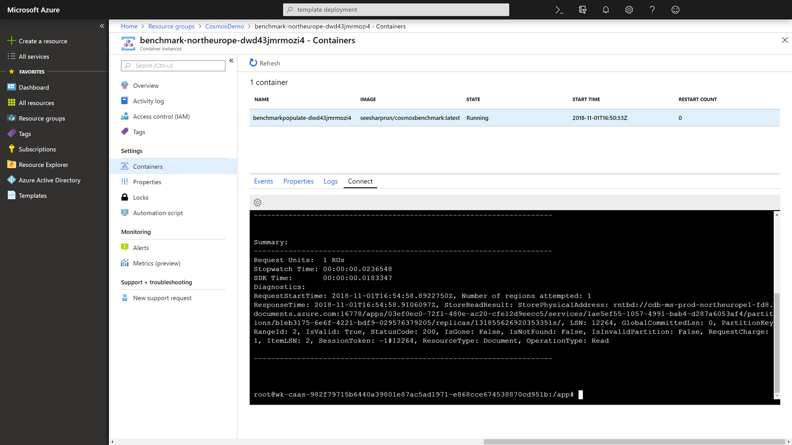

1. Click on the **Resource Groups** link in the portal, selecting your previously created group, and then select the sole **Azure Cosmos DB** resource again.

1. In the Azure Cosmos DB resource's blade, select the **Default consistency** option.

    

    > You can configure the default consistency level on your Cosmos DB account at any time. The default consistency level configured on your account applies to all Cosmos databases (and containers) under that account. All reads and queries issued against a container or a database will use that consistency level by default.

1. Observe that the default consistency level is set to **Session**.

    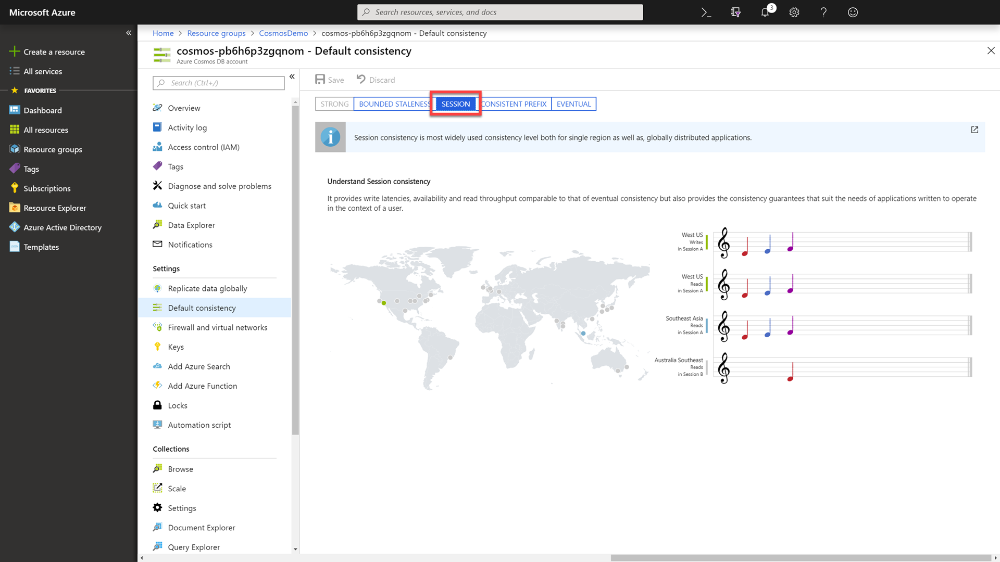

    > Session consistency is a "middle of the road" consistency option that strikes a good balance between the polarized Strong and Eventual consistency options by enforcing strong consistency within a client session and eventual consistency for all other clients.

1. Change the consistency level to **Eventual** and then click the **Save** button.

    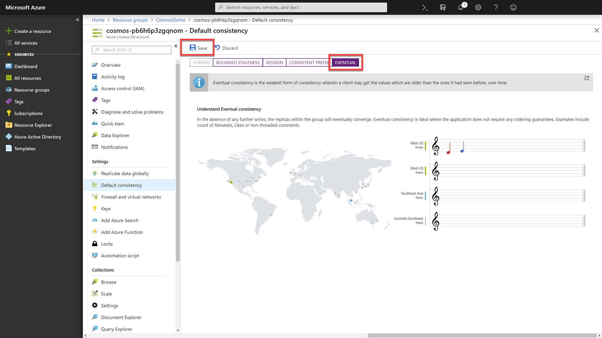

    > You can change the default consistency level that is applied to all future requests. Eventual consistency improves read scalability, offers higher availability and often results in lower latency. The tradeoff is that a client may potentially see "stale" data.

## More Reading

If attendees want to learn more about Azure Cosmos DB and global distribution, it is recommended that they read the following article: <https://docs.microsoft.com/azure/cosmos-db/distribute-data-globally>

===

# Document Flexibility using Azure Cosmos DB

For the last demo, we will populate our Azure Cosmos DB instance with various documents that do not conform to a standardized schema or structure. We are going to take advantage of the automatic indexing and flexible nature of Azure Cosmos DB to query for documents based on fields that may or may not be in every document.

## Step-by-step instructions

1. To start, we will go into the Azure Cosmos DB account. This can be accomplished by clicking on the **Resource Groups** link in the portal, selecting your previously created group, and then selecting the sole **Azure Cosmos DB** resource.

    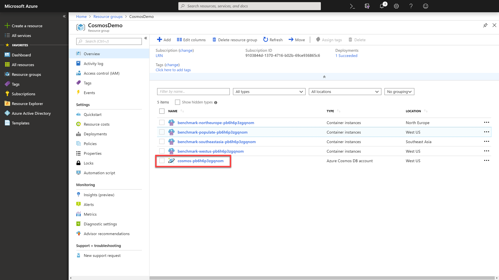

1. In the Azure Cosmos DB resource's blade, select the **Data Explorer** option.

    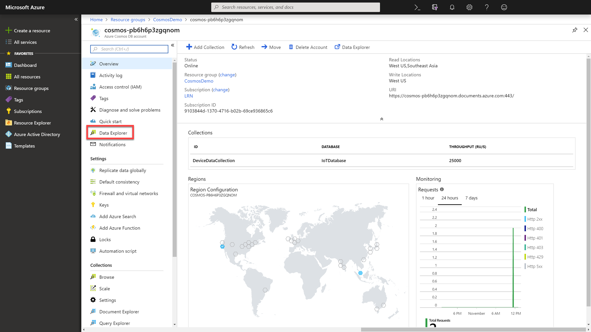

1. In the **Data Explorer**, click the **New Collection** button.

    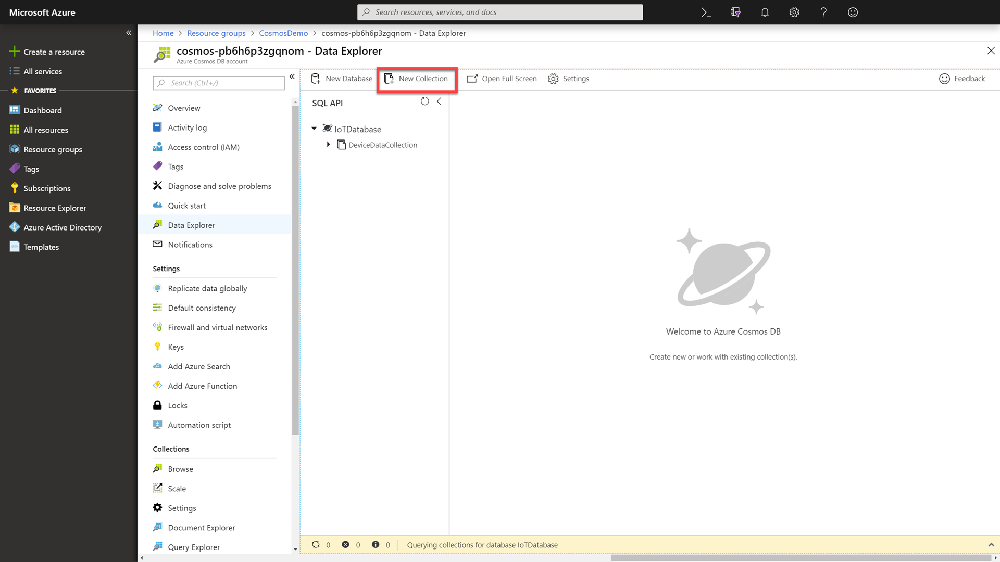

    > You can call out to attendees that you will create a new collection where you intend to perform the demo.

1. In the **New Collection** popup, perform the following actions:

    1. In the **Database id** section, select the **Create new** option, and enter the value ``DynamicDatabase`` in *Type a new database id* field.

    1. Ensure that the **Provision database throughput** checkbox is not selected.

    1. In the **Collection id** field, enter the value ``DataRepository``.

    1. In the **Storage capacity** section, select the **Fixed (10 GB)** option.

    1. In the **Throughput** section, enter the value ``1000``.

    1. Click the **OK** button.

    1. Wait for the new database and collection to be created.

    

1. In the **Data Explorer**, locate and expand the newly created **DynamicDatabase** database. Then select and expand the **DataRepository** collection.

    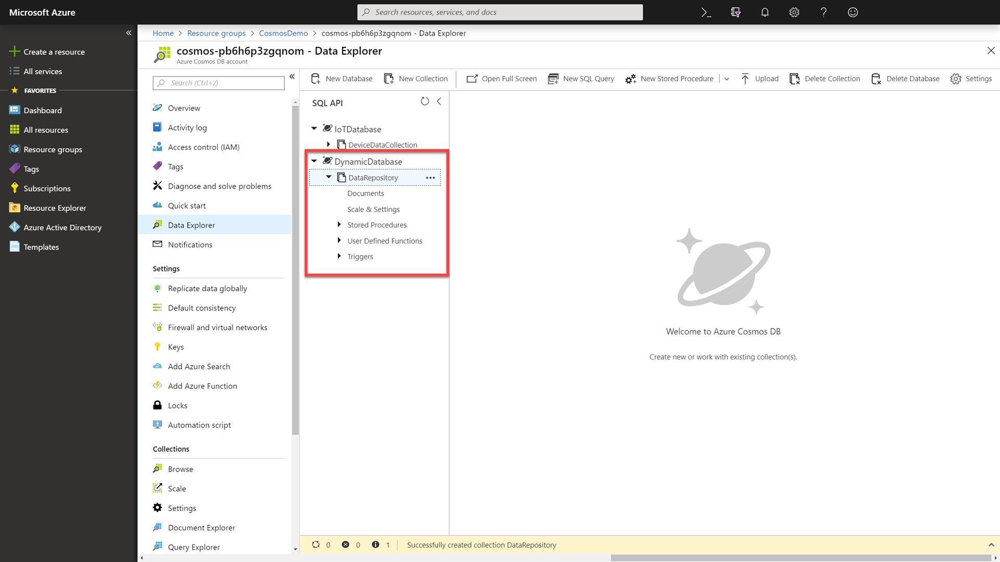

1. Click the **Open Full Screen** button to open a dialog giving multiple options to view the Data Explorer in full-screen mode. Select the **Read-Write** option and then click the **Open** button to open the Data Explorer in full-screen mode.

    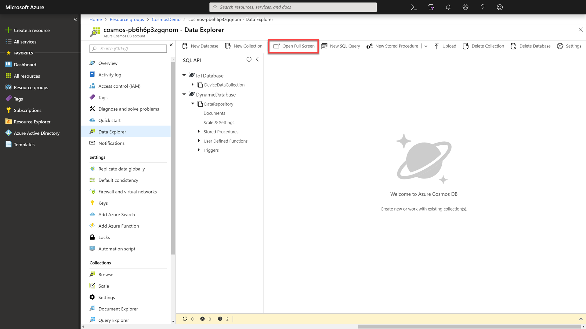

    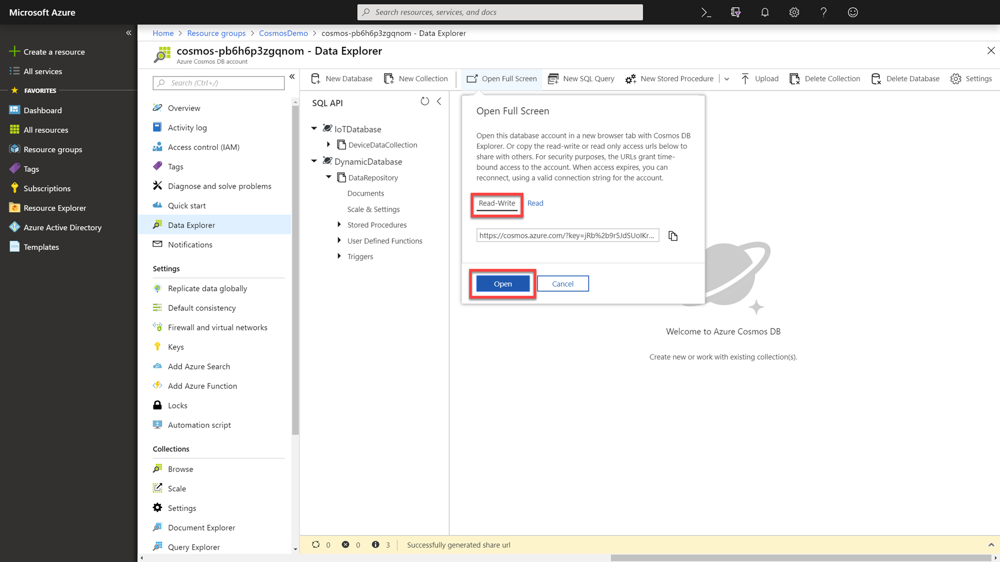

    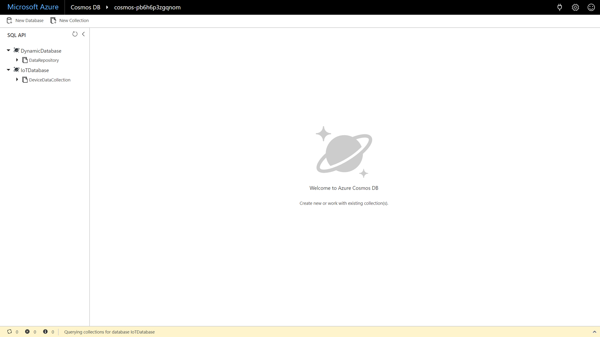

    > The remaining demo instructions and screenshots will assume that you are in full-screen mode.

1. Locate and expand the **DynamicDatabase** database. Then select and expand the **DataRepository** collection.

    > We now have a clustered database that is partitioned across machines for both scalability and performance. As a developer, we want to be able add documents to this database's collections.

    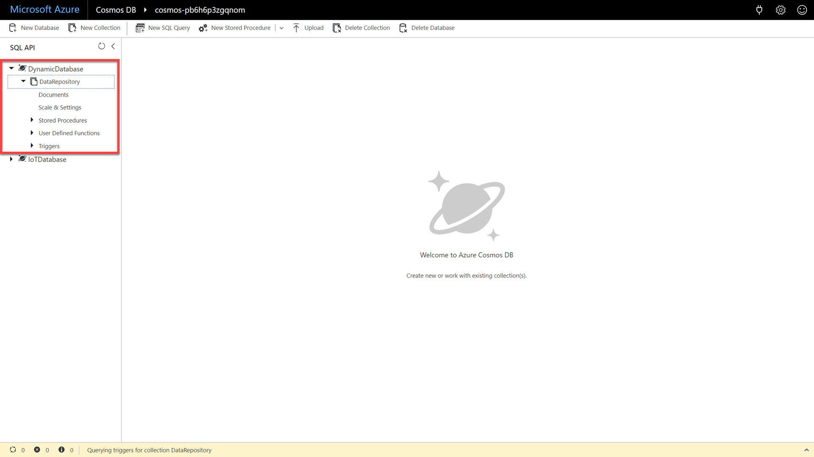

    > In this example scenario, we have a collection of contact information coming from many different third-party systems that collects and sends us leads for customers.

1. Click the **Documents** option.

    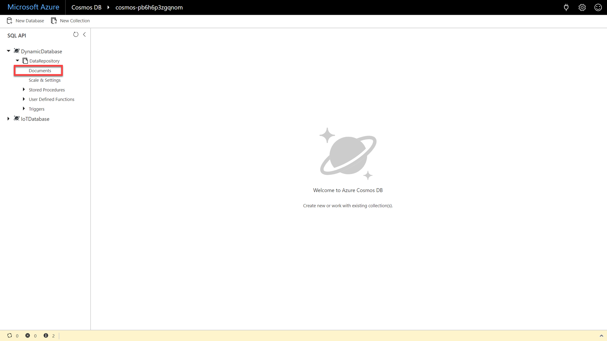

1. Click the **New Document** button.

    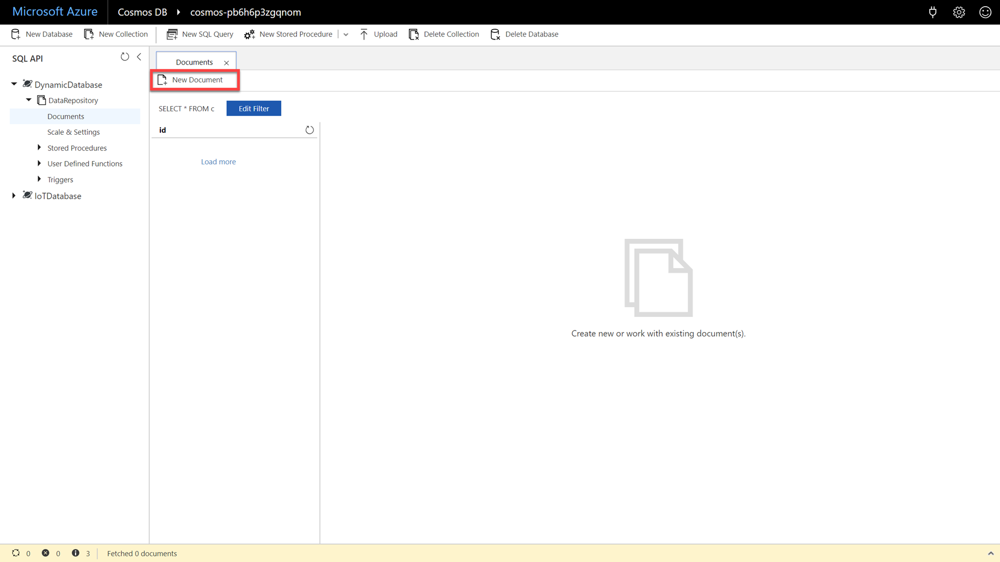

1. In the document editor, enter the following JSON content:

    ```
    {
        "name": "Jeannette Kjaer",
        "permissionToCall": true,
        "phoneNumber": {
            "home": "+1 555-555-1234",
            "work": "+1 555-555-5678 x901"
        },
        "mailingAddress": {
            "streetAddress": "123 Anywhere St.",
            "city": "Springfield",
            "state": "MO",
            "postal": 99999
        }
    }
    ```

    > This first example document comes from a company that has child fields within an embedded document for the contact information. 

1. Click the **Save** button to persist the document and then observe the newly created document.

    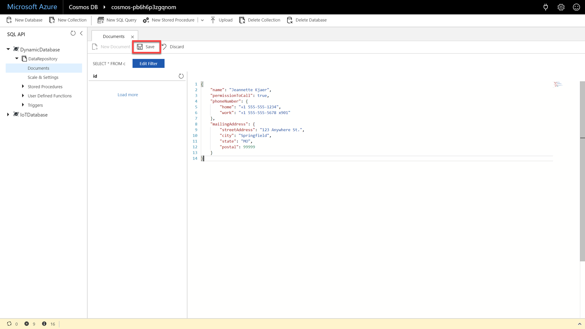

1. Click the **New SQL Query** button.

    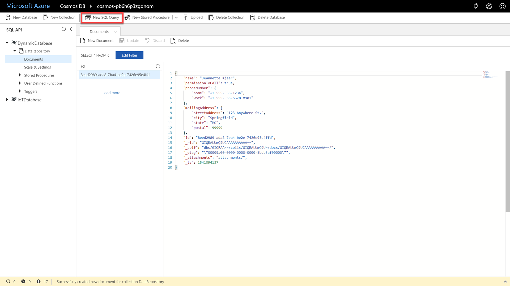

    > Since we know the structure of the first JSON document, we can make some simple SQL queries.

1. In the **New SQL Query** window, enter the following SQL command:

    ```
    SELECT * FROM contacts
    ```

1. Click the **Execute Query** button to issue the query and observe the query results.

    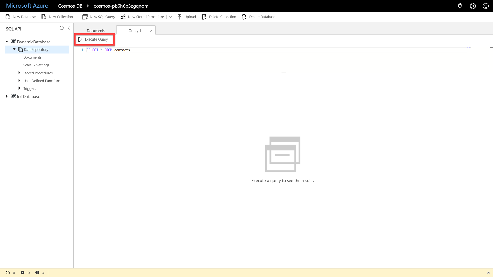

    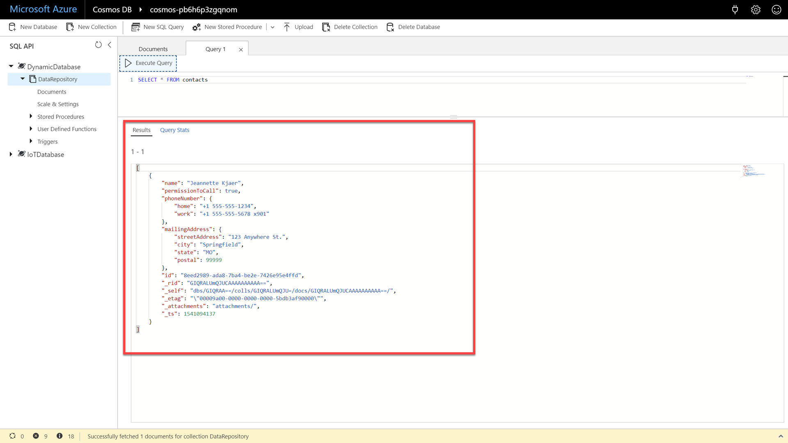

1. Enter and execute the following command:

    ```
    SELECT c.phoneNumber.home AS homeNumber
    FROM contacts c
    WHERE c.permissionToCall = true
    ```

    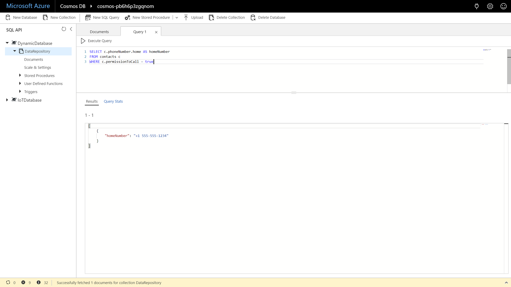

    > This query returns a flattened array of phones numbers that we are allowed to call. It filters on the ``permissionToCall`` field. Point out to attendees that Azure Cosmos DB returns a full object for every query results.

1. Enter and execute the following command:

    ```
    SELECT VALUE c.phoneNumber.home
    FROM contacts c
    WHERE c.permissionToCall = true
    ```

    

    > This query is the same as the previous query but it flattens the results into a simple JSON array of strings. This makes it easier for client applications to parse the query results. To give attendees a code example; in .NET you can deserialize this into a ``List<string>`` instead of creating a new C# class with a single property.

1. Enter and execute the following command:

    ```
    SELECT 
        c.name, 
        c.phoneNumber.home AS homeNumber, 
        CONCAT(c.mailingAddress.streetAddress, " ", c.mailingAddress.city, ", ", c.mailingAddress.state, " ", ToString(c.mailingAddress.postal)) AS address
    FROM contacts c
    WHERE c.permissionToCall = true
    ```

    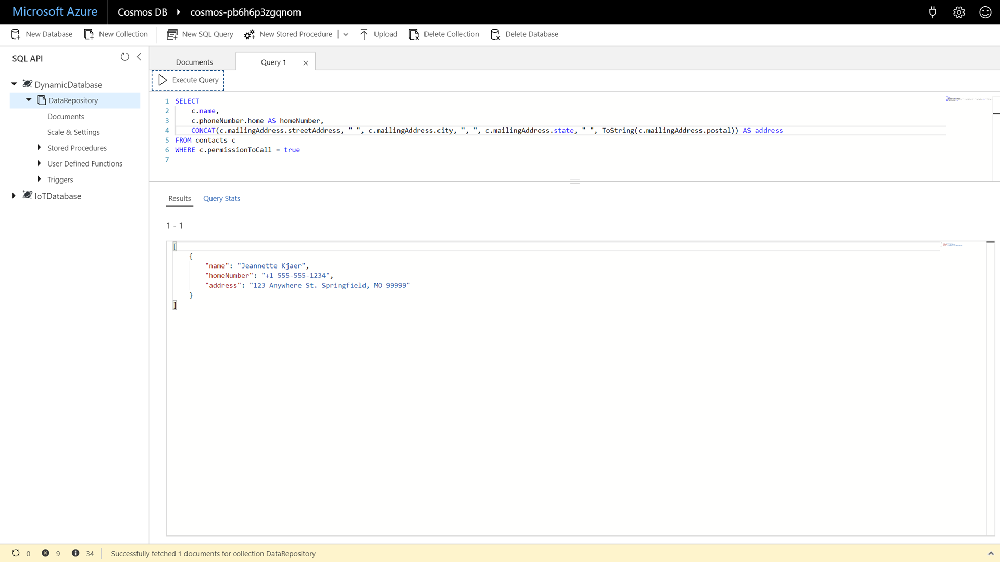

    > This is a more complex query that takes into account some of the nuances of the way the individual's address is stored.

1. Within the **DataRepository** collection, click the **Scale & Settings** option.

    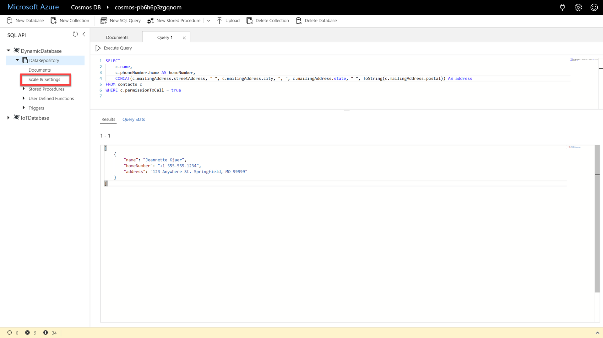

1. Within the **Scale and Settings** tab, locate and observe the **Indexing Policy**:

    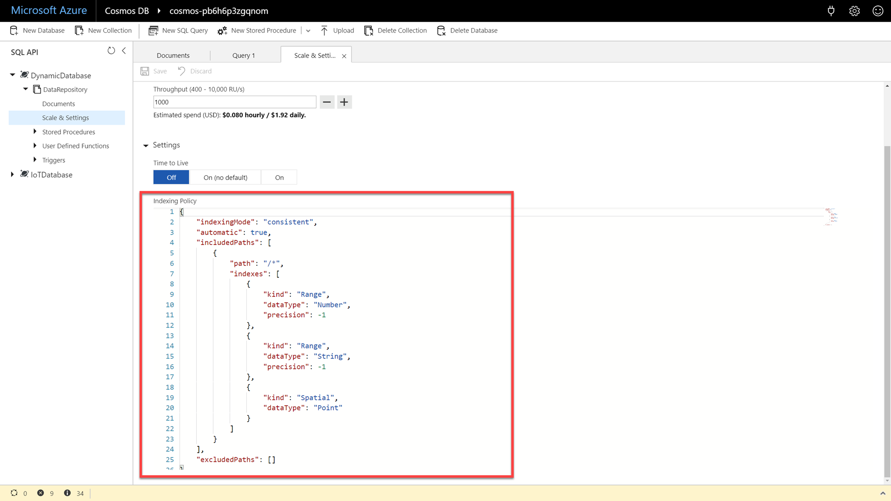

    > By default, all Azure Cosmos DB data is indexed. The indexing policy that is displayed will effectively index all paths in the JSON document. In Azure Cosmos DB, you can design and customize the shape of the index without sacrificing schema flexibility. Let attendees know that they can always tune and change the index if they want to "squeeze a little more performance" out of their collection by making specific strategic compromises in flexibility.

    > For today's demo, we can take advantage of the schema-agnostic nature of Azure Cosmos DB by adding in JSON documents that do not conform to the same JSON schema. Since we are automatically indexing all paths, we will be able to flexibly query on properties that may not be in all documents.

1. Within the **DataRepository** collection, click the **Documents** option.

    > What if we need to change a document in the database, will that cause migrations or downtime? In our example scenario, we found out that other companies have an **active** field while the first company assumes all documents are active. To solve this, we need to add a property named **active** set to a value of **true** to our existing document[s]. In a RDBMS, we would have to write migration scripts that would alter tables, rebuild indexes and move data. We would also have to deploy these migration scripts across multiple machines while avoiding downtime. This is prohibitively difficult.

1. In the **Documents** tab, select the single document that you created earlier in this demo.

    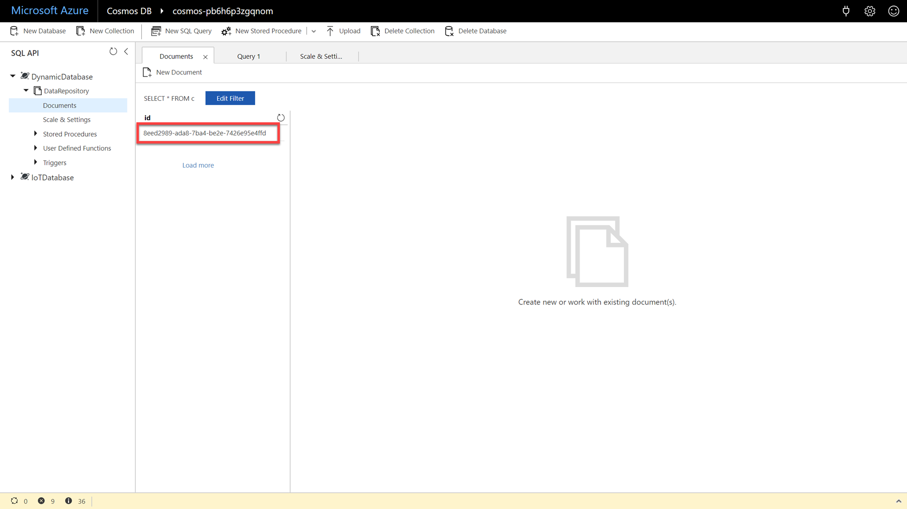

1. In the document editor, add a new property named **active** and set it's value to **true**:

    ```
    "active": true
    ```

    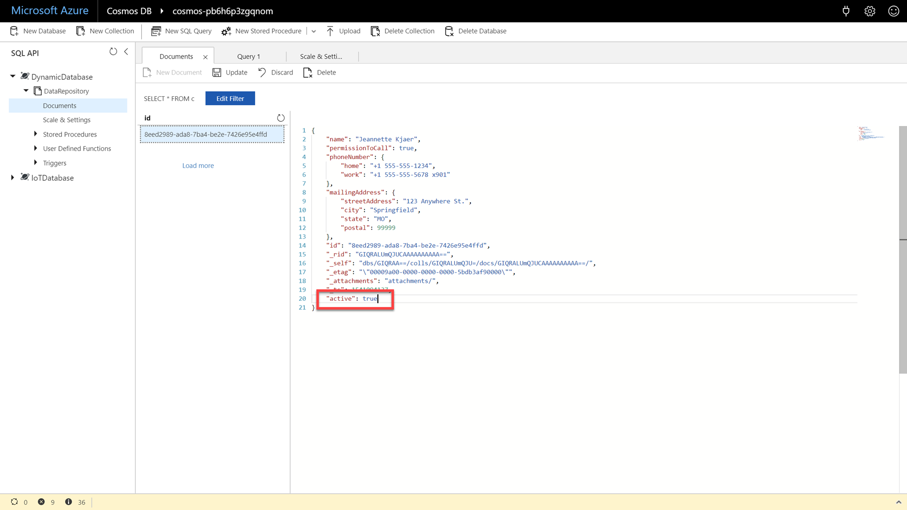

1. Click the **Update** button to persist the document's changes.

    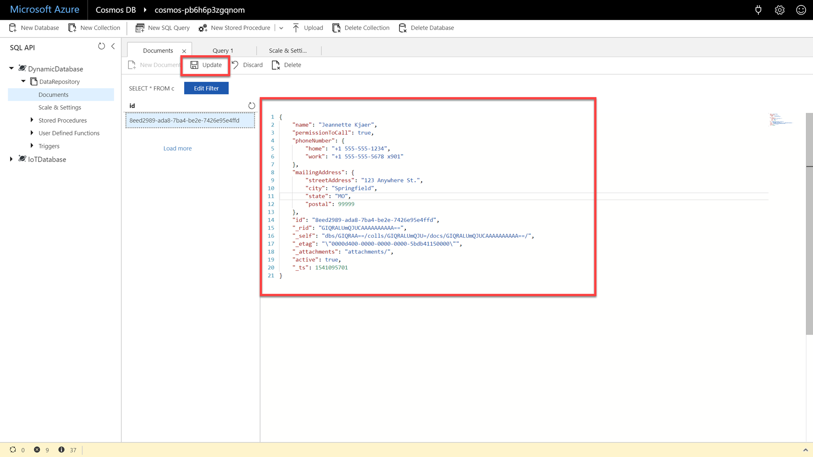

1. Click the **New SQL Query** button.

1. In the **New SQL Query** window, enter the following SQL command:

    ```
    SELECT 
        c.name, 
        c.phoneNumber.home AS homeNumber, 
        CONCAT(c.mailingAddress.streetAddress, " ", c.mailingAddress.city, ", ", c.mailingAddress.state, " ", ToString(c.mailingAddress.postal)) AS address,
        c.active
    FROM contacts c
    WHERE c.permissionToCall = true
    ```

    > We are updating our earlier query to include the new **active** property. Our automatic indexer has already "picked up" this property and we can use it immediately in queries.

1. Click the **Execute Query** button to issue the query and observe the query results.

    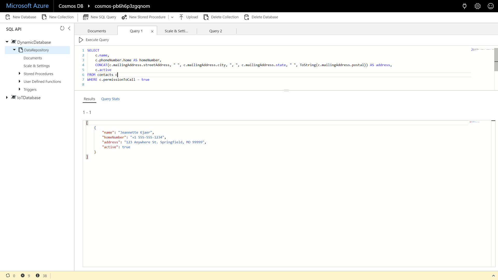

1. Within the **DataRepository** collection, click the **Documents** option.

    > Introduce a potential scenario to attendees. "What if we have a second company that we work with that provides JSON document in an entirely different structure?". Essentially, we need to use new properties in the next document. In a RDBMS, we would need to either expand the existing table or build a new table. Just like with changing a document, this can be prohibitively difficult.

1. Click the **New Document** button.

1. In the document editor, enter the following JSON content:

    ```
    {
        "name": "Adam Brooks",
        "permissionToCall": true,
        "phoneNumbers": [
            "+1 555-555-9999"
        ],
        "address": "345 Somewhere Ave. Springfield, MO 99999",
        "active": false
    }
    ```

    > This second example document comes from a different company that has a relatively flatter JSON document structure. Since we are familiar with the vendor, we can make some assumptions about this document. For example, we know the first phone number in the array is always the home phone number. This record does not have a work phone number.

1. Click the **Save** button to persist the document and then observe the newly created document.

    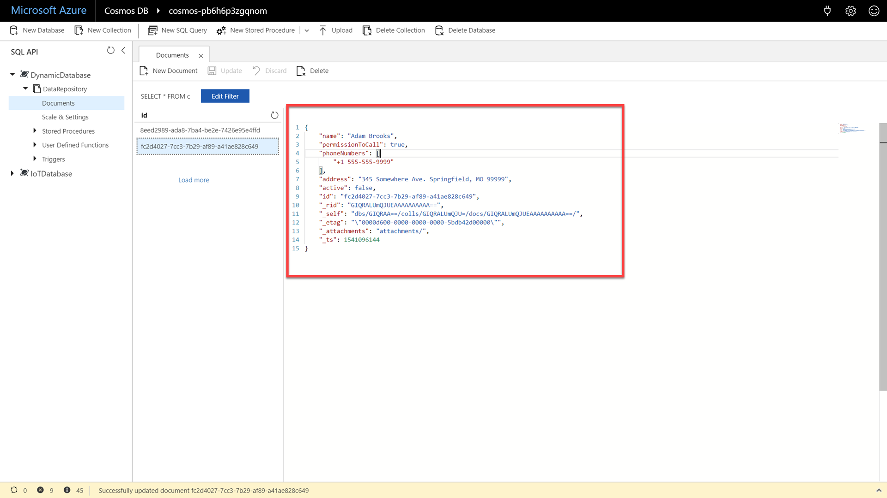

    > The "solution" to our problem is to use a schema-agnostic database like Azure Cosmos DB that automatically indexes all paths from all documents. We now have an inverted index that contains information from fields that exist in either document in our collection.

1. Click the **New SQL Query** button.

1. In the **New SQL Query** window, enter the following SQL command:

    ```
    SELECT 
        c.name,
        c.phoneNumber
    FROM 
        contacts c    
    ```

    > If you attempt to return a property that exists in some documents and not others, the query can safely "skip" that property in documents where it doesn't exist.

    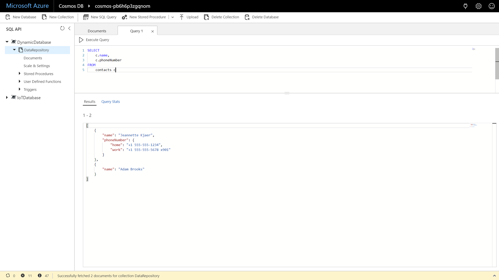

1. Enter and execute the following command:

    ```
    SELECT 
        * 
    FROM 
        contacts c
    WHERE
        c.mailingAddress.state = "MO"
    ```

    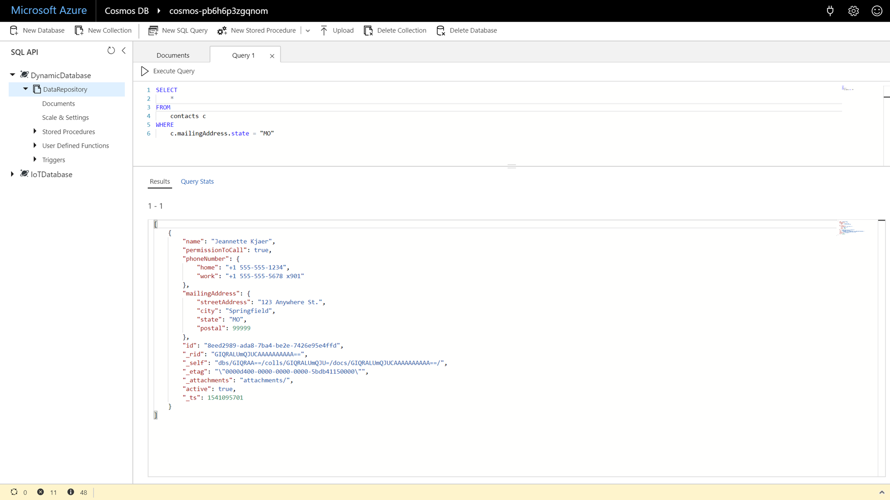

    > If you try to filter on a property that only exists in some documents, the query results will only include documents that contain the properties specified in the filter[s].

1. Enter and execute the following command:

    ```
    SELECT 
        * 
    FROM 
        contacts c
    WHERE
        IS_DEFINED(c.phoneNumbers)
    ```

    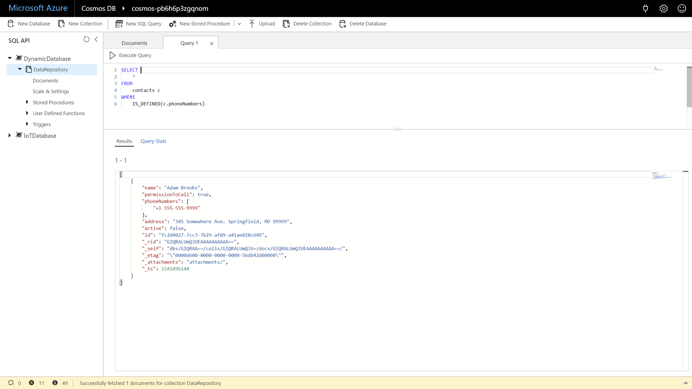

    > This query can find documents that have specific properties using the special ``IS_DEFINED`` function.

1. Enter and execute the following command:

    ```
    SELECT 
        c.name, 
        IS_DEFINED(c.phoneNumbers) ? c.phoneNumbers[0] : c.phoneNumber.home AS homeNumber, 
        c.address ?? CONCAT(c.mailingAddress.streetAddress, " ", c.mailingAddress.city, ", ", c.mailingAddress.state, " ", ToString(c.mailingAddress.postal)) AS address,
        c.active
    FROM contacts c
    WHERE c.permissionToCall = true
    ```

    > This query includes many of the unique operations in the Azure Cosmos DB SQL API's query language that allows us to construct a single query that can work across multiple documents with different schemas. Point out to attendees that some of the operators used here (Ternary and Coalesce) are very similar to the C# counterparts.

1. Click the **Execute Query** button to issue the query and observe the query results.

    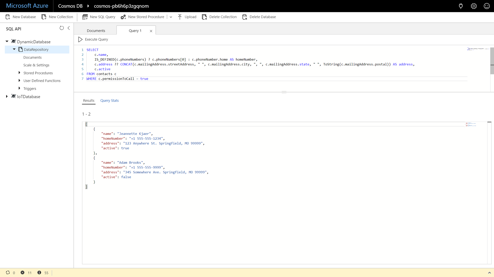

## More Reading

If attendees want to learn more about modeling flexibly structed data in Azure Cosmos DB, it is recommended that they read the following article: <https://docs.microsoft.com/azure/cosmos-db/modeling-data>

===
